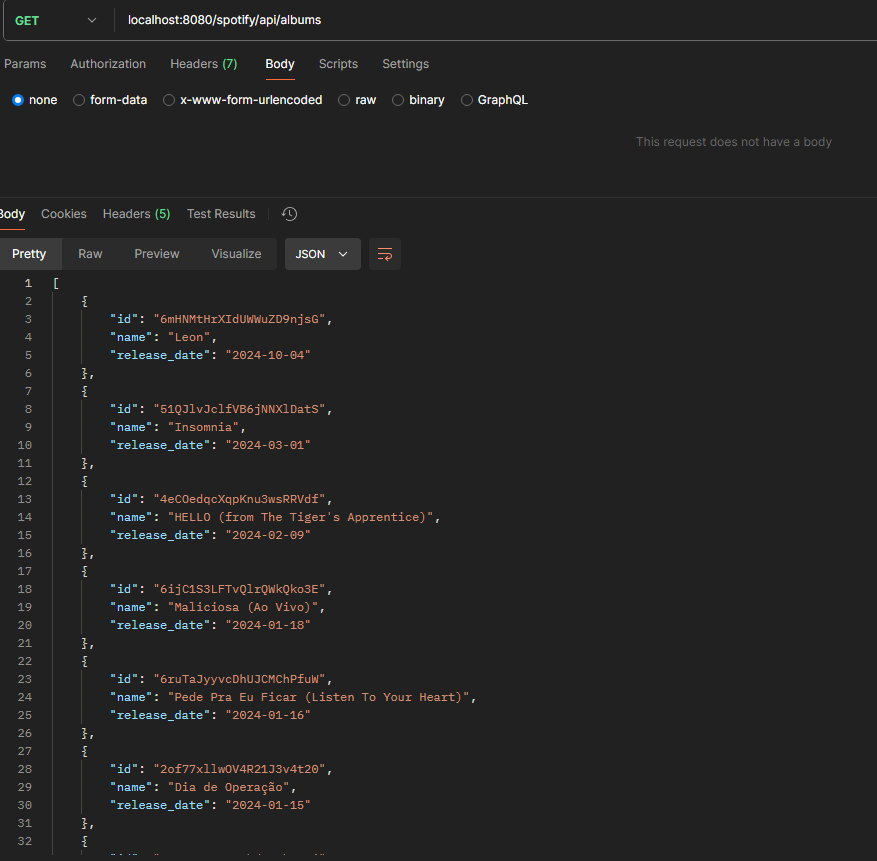

# About

Simple project consuming the Spotify API, suing Java and Spring + OpenFeign.

# Spotify

Register yourself on the developer page in the spotify website, go to the dashboard and create one for you.

Insert the name, description and the default url witch will be localhost:8080.

As soon as you create the dashboard, you can access the settings menu, where you can find your clientId
and secretClient. We will use it for authentication later.

Every request, we have to authenticate where eventually the spotify will autorize! So, lets go to the Spring Application
and start doing the authentication process.

# Application

Alright, so, before we start we have to understand. What will we need to do? Check the [Gettinng started with Web API](https://developer.spotify.com/documentation/web-api/tutorials/getting-started)

1. We will need to create an app (witch we already did)
2. Request an access token;
3. Use the token to request the artist data

## Http request example

Send a POST request to the token endpoint URI.

Add the Content-Type header set to the application/x-www-form-urlencoded value.

Add an HTTP body containing the Client ID and Client Secret, along with the grant_type parameter set to client_credentials.

```http request
POST
    
-X "https://accounts.spotify.com/api/token" \
-H "Content-Type: application/x-www-form-urlencoded" \
-d "grant_type=client_credentials&client_id=your-client-id&client_secret=your-client-secret"
```

The response will return an access token valid for 1 hour:

```json
{
  "access_token": "BQDBKJ5eo5jxbtpWjVOj7ryS84khybFpP_lTqzV7uV-T_m0cTfwvdn5BnBSKPxKgEb11",
  "token_type": "Bearer",
  "expires_in": 3600
}
```

First things first, we'll create a controller package, with a AlbumController class.

The URL will be: ``/spotify/api``.

The first method will be a GET, with ``/albums`` as the URL.

This class will be responsible

# How to use Feign?

In the main class of the application we have to use the annotation ``@EnableFengClients``. With this, the Spring will
know that we will use the Feign Client inside our project.

## First time, example

After this, we can create a package ``client``. To use Feign, we will create an interface. This interface will have the 
``@FeignClient`` annotation, and the Spring context will understand that this application is in fact an FeignClient.

We can open the brackets and insert the properties. If you use CTRL + LEFT CLICK you can open the class and see all the
properties:


We will use: name (name of the Feign Client) and url (the destiny of the http request).

As an example, we are going to return the Google page!

```java
@FeignClient(
        name = "GoogleClient",
        url = "https://google.com"
)
public interface GoogleClient {

    @GetMapping
    String helloWorld();
}
```

Just as a test, we are going to our ``AlbumController``, inject this interface and use it in our GET.

```java
@RestController
@RequestMapping("spotify/api")
public class AlbumController {
    
    private final GoogleClient googleClient;

    public AlbumController(GoogleClient googleClient) {
        this.googleClient = googleClient;
    }
    
    @GetMapping("/albums")
    public ResponseEntity<String> helloWorld() {
        return ResponseEntity.ok(googleClient.helloWorld());
    }
}
```

If we start the application and go to the ``localhost:8080/spotify/api/albums`` we will see this:


Ok, this was just a text to use Feign for the first time, let's go back to the point of the study!


# FeignClient to authenticate (Getting Token)

Ok, now it's the real deal. We are going to make a request for the Spotify API, and authenticate it.

We are going to create an interface ``AuthSpotifyClient`` and we'll do the same thing. Use the ``@FeignClient``, but this
time, using the spotify parameters.

The URL is going to be this one:


We are going to cut the ``/api/token``.

Now we need to do the method that's going to be responsible to make the request, recovering the token. To do this, we
need to: send and receive data.

So we need to map two classes on the application: requestDTO and responseDTO. It'll be classes and not record because we
eventually are going to use some anottations, since the request is "urlencoded" and not JSON.

The first one can be the request. We can map this attributes: grant_type, client_id and client_secret.

The second one is going to be just the token.

#### LoginRequestDTO

```java
@AllArgsConstructor
@NoArgsConstructor
@Getter
@Setter
public class LoginRequestDTO {

    @FormProperty("grant_type")
    private String grantType;
    
    @FormProperty("client_id")
    private String clientId;

    @FormProperty("client_secret")
    private String clientSecret;

}
```

#### LoginResponseDTO

We have to use this ``@JsonProperty`` since the response on the JSON is written like this!


```java
@NoArgsConstructor
@AllArgsConstructor
@Getter
@Setter
public class LoginResponseDTO {

    @JsonProperty("access_token")
    private String accessToken;

}
```

## AuthSpotifyClient Method

We create a POST method, using the URL that we cut out, and the consume property (since we are using form-urlencoded).

```java
@FeignClient(
        name = "AuthSpotifyClient",
        url = "https://accounts.spotify.com"
)
public interface AuthSpotifyClient {

    @PostMapping(value = "/api/token", consumes = MediaType.APPLICATION_FORM_URLENCODED_VALUE)
    LoginResponseDTO login(@RequestBody LoginRequestDTO loginRequestDTO);
}
```

## AlbumController

Finally! We are going to use the interface and Feign on the Controller.

Same stuff, we inject the interface using the constructor.

We create two Strings variables to use the clientId and clientSecret.

Inside the method we create a request (LoginRequestDTO).

The first attribute ``clientCredentials`` it will be the same thing always.

After, the id and secret.

And lastly we return using the Feign method.

We put in the parameter the request and since the return is a ResponseDTO, we use the ``get``, to recover the access token.

```java
@RestController
@RequestMapping("spotify/api")
public class AlbumController {

    @Value("${clientId}")
    private String clientId;

    @Value("${clientSecret}")
    private String clientSecret;

    private final AuthSpotifyClient authSpotifyClient;

    public AlbumController(AuthSpotifyClient authSpotifyClient) {
        this.authSpotifyClient = authSpotifyClient;
    }

    @GetMapping("/token")
    public ResponseEntity<String> getToken() {
        var request = new LoginRequestDTO(
                "client_credentials",
                clientId,
                clientSecret
        );

        return ResponseEntity.ok(authSpotifyClient.login(request).getAccessToken());

    }
}
```

# FeignClient - New Releases 

In this interface, we are going to consume the album API (new realises).

[Link](https://developer.spotify.com/documentation/web-api/reference/get-new-releases)

The endpoint ⬇️


We are going until the ``.com``

Same stuff, create an interface ``AlbumSpotifyClient``, use the annotation and the properties.

To use this endpoint, first we need to get the token using the authorization method! So, we need to pass the header
authorization on the method.

This is the response for this GET method:


So, we need to create three classes:

1. One class that will be the entire Response, it's the object!;
2. The second one, it'll be like a "wrapper", it'll be ``AlbumWrapper``, it'll have the href, next, offset, previous, etc;
3. The third one, it'll be list of items inside the second class, the class will be named ``Album``.


Check it out:

❗Always using ``@JsonNaming(PropertyNamingStrategies.SnakeCaseStrategy.class)`` since some properties returns snake_case.

## AlbumResponse (The object)


Check the indicator. It's the WHOLE object. After that, we have the ``albums``, that we create it ⬇️.

This album is like a "wrapper" since he was EVERYTHING inside it.

```java
@NoArgsConstructor
@AllArgsConstructor
@Getter
@Setter
@JsonNaming(PropertyNamingStrategies.SnakeCaseStrategy.class)
public class AlbumResponse {

    private AlbumWrapper albums;
}
```

## AlbumWrapper


Inside the "albums", you can see that we have the list of items (the albums), we create it as well.

```java
@NoArgsConstructor
@AllArgsConstructor
@Getter
@Setter
@JsonNaming(PropertyNamingStrategies.SnakeCaseStrategy.class)
public class AlbumWrapper {

    private List<Album> albums;
}
```

## Albums

It only has 3 attributes, but you could get other ones as well, like ``album_type``, ``total_tracks``, etc.


```java
@NoArgsConstructor
@AllArgsConstructor
@Getter
@Setter
@JsonNaming(PropertyNamingStrategies.SnakeCaseStrategy.class)
public class Album {

    private String id;
    private String name;
    private String releaseDate;
}
```

## AlbumSpotifyClient (Interface)

Returning the AlbumResponse (since it's the whole object).

We can use the annotation ``@RequestHeader`` using the token.

```java
@FeignClient(
        name = "AlbumSpotifyClient",
        url = "https://api.spotify.com"
)
public interface AlbumSpotifyClient {

    @GetMapping(value = "v1/browse/new-releases")
    AlbumResponse getNewReleases(@RequestHeader("Authorization") String authorization);
}
```

## AlbumController

We inject the AlbumSpotifyClient.

Since we have to get the token, we create a request with the credentials, recovering the token, and using it in the
``AlbumSpotifyClient``!

```java
    @GetMapping("/albums")
    public ResponseEntity<List<Album>> getNewReleases() {
        var request = new LoginRequestDTO(
                "client_credentials",
                clientId,
                clientSecret
        );
        var token = authSpotifyClient.login(request).getAccessToken();

        var response = albumSpotifyClient.getNewReleases("Bearer " + token);

        return ResponseEntity.ok(response.getAlbums().getItems());
    }
```

### Postman

